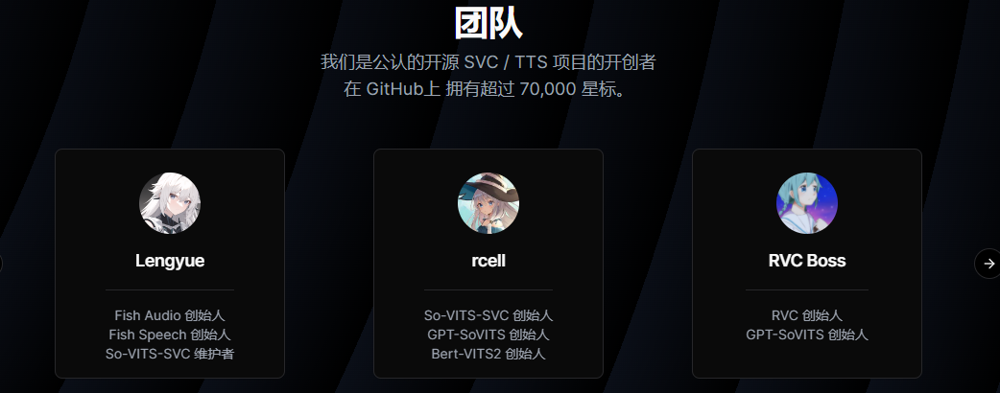
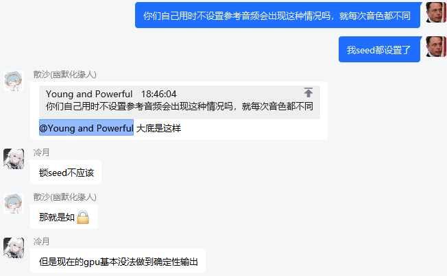
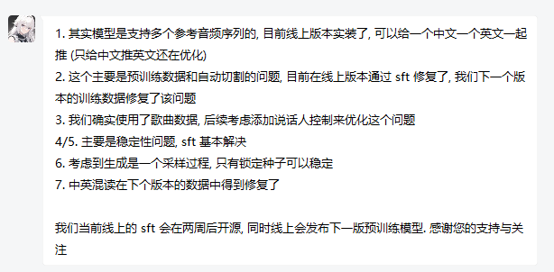
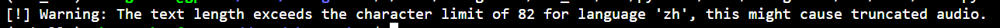

# TTS(Text To Speech)初步调研

[toc]


## 1.[fish-speech](https://github.com/fishaudio/fish-speech)

### 1.0 模型背景

[fish-speech-1.2](https://huggingface.co/fishaudio/fish-speech-1.2) 发布于2024年7月2日，国内**Fish Audio**团队开发的模型，其中多名开发者参与过`So-VITS-SVC`、`GPT-SoVITS`等著名TTS项目，使用了 30万小时的**中英日数据**训练而成，github上收获了4.8kstars。demo网页：[https://fish.audio/zh-CN/](https://fish.audio/zh-CN/)，据开发者所悉，网页上的模型即huggingface上发布的预训练模型sft而成。

### 1.1模型效果

#### 1.1.1 模型优势

1.通过设置一段该人的语音及其对应的标注文件（lab）作为参考音频，可以快速复制某人的发音样式。

利用施一公老师的一段话作为参考，生成的一段语音：

<audio id="audioPlayer" controlslist="nodownload" controls="" src="./0.mp3" style="position: relative; width: 565px; height: 54px; left: 0px; top: 0px;"></audio>

2.模型显存占用低（1704MiB ）；显存占用率低（37% ；A40）；单推理的生成速度约是3:4（音频长度:生成时间）

3.模型已有完整的api（含流式传输）服务框架

#### 1.1.2 存在的问题

1.参考序列只能设置一个，如果生成的**语种与参考序列不同**，那么效果适得其反

```
Genome-wide association studies (GWAS) refer to the association research between genes and diseases conducted on a genome-wide scale, involving multi-center, large-sample, and repeated verification. GWAS is a research method that involves genotyping of high-density genetic markers (such as SNPs or CNVs) across large population DNA samples to identify genetic factors associated with complex diseases, comprehensively revealing the genetic genes related to the onset, development, and treatment of diseases
```

使用施一公中文音频作为参考音频后，对以上英文内容进行生成：

<audio id="audioPlayer" controlslist="nodownload" controls="" src="./0.5.mp3" style="position: relative; width: 565px; height: 54px; left: 0px; top: 0px;"></audio>

不使用参考序列时生成的效果：

<audio id="audioPlayer" controlslist="nodownload" controls="" src="./0.75.mp3" style="position: relative; width: 565px; height: 54px; left: 0px; top: 0px;"></audio>

2.大部分时候，模型生成在一些地方尤其是标点处有**不自然的停顿**：

<audio id="audioPlayer" controlslist="nodownload" controls="" src="./1.mp3" style="position: relative; width: 565px; height: 54px; left: 0px; top: 0px;"></audio>

3.**在不使用参考序列的情况下**，有一定概率出现唱歌现象，可能使用了歌曲音频作为训练数据：

<audio id="audioPlayer" controlslist="nodownload" controls="" src="./2.mp3" style="position: relative; width: 565px; height: 54px; left: 0px; top: 0px;"></audio>

4.**在不使用参考序列的情况下**，有一定概率音频产生不完整：

<audio id="audioPlayer" controlslist="nodownload" controls="" src="./3.mp3" style="position: relative; width: 565px; height: 54px; left: 0px; top: 0px;"></audio>

5.**在不使用参考序列的情况下**，有一定概率完全杂音：

<audio id="audioPlayer" controlslist="nodownload" controls="" src="./4.mp3" style="position: relative; width: 565px; height: 54px; left: 0px; top: 0px;"></audio>

6.**在不使用参考序列的情况下**，无法固定speaker音色：



*（源自与开发者的对话）*

7.中英文混杂能力有待提升，英文出现大写字母时会单独读出来，合成词无法正确读出来

```
我是Futuregene公司开发的westlakechat
```

<audio id="audioPlayer" controlslist="nodownload" controls="" src="./5.mp3" style="position: relative; width: 565px; height: 54px; left: 0px; top: 0px;"></audio>

### 1.3 Further Engineering

1.开源的是pre-trained model，网页上的是sft后的版本，目前还有提升空间。

2.以目前的框架设计来看，如果要上线要分开两个语言环境去设计，且对于中英混杂型的发言不大友好。

3.最好等待开发者的迭代更新，这些情况我都已经反馈给开发者了。

#### 总结




*（源自与开发者的对话，开发者对以上问题的解释）*

该模型在部分案例上表现较好，但大部分案例表现的不是很稳定，只有使用参考序列且生成语种一致时，稳定性较高，如果语种不一致则适得其反，在运行性能上有较好的表现，同时还存在很多时不时出现的问题隐患，模型技术还是不大成熟，开发者们目前正在积极调整模型框架，后续将会有更先进的模型上线，目前情况不适合直接上线。

模型性能：    ★★★☆☆

模型效果：    ★★★☆☆

模型稳定性：★★☆☆☆

模型成长性：★★★★★

## 2.[XTTS](https://github.com/coqui-ai/TTS)

### 2.0 模型背景

[XTTS-v2 ](https://huggingface.co/coqui/XTTS-v2)发布于2023年11月，国外**Coqui**公司开发的模型，母公司为火狐公司。目前支持 17 种语言，在github上收获了31.9k stars，在huggingface上所有TTS模型中下载量排行第一、likes排行第二。demo页面：[https://huggingface.co/spaces/coqui/xtts](https://huggingface.co/spaces/coqui/xtts)

### 2.1 模型效果

#### 2.1.0 中文案例

```
全基因组关联研究是指在全基因组层面上,开展多中心、大样本、反复验证的基因与疾病的关联研究。
```

<audio id="audioPlayer" controlslist="nodownload" controls="" src="./6.mp3" style="position: relative; width: 565px; height: 54px; left: 0px; top: 0px;"></audio>

#### 2.1.1 英文案例

```
Genome-wide association studies (GWAS) refer to the association research between genes and diseases conducted on a genome-wide scale, involving multi-center, large-sample, and repeated verification. GWAS is a research method that involves genotyping of high-density genetic markers (such as SNPs or CNVs) across large population DNA samples to identify genetic factors associated with complex diseases, comprehensively revealing the genetic genes related to the onset, development, and treatment of diseases
```

<audio id="audioPlayer" controlslist="nodownload" controls="" src="./7.mp3" style="position: relative; width: 565px; height: 54px; left: 0px; top: 0px;"></audio>

#### 2.1.3 中英混杂案例

```
我是Futuregene公司开发的westlakechat
```

以en为目标语言：

<audio id="audioPlayer" controlslist="nodownload" controls="" src="./8.mp3" style="position: relative; width: 565px; height: 54px; left: 0px; top: 0px;"></audio>

以zh为目标语言：

<audio id="audioPlayer" controlslist="nodownload" controls="" src="./9.mp3" style="position: relative; width: 565px; height: 54px; left: 0px; top: 0px;"></audio>

#### 2.1.4 模型性能

显存占用约3.7GB；显存利用率约为40%

单推理的生成速度约是 1:1.23（音频长度:生成时间）

#### 2.1.5 存在的问题

1.对输入文本长度有限制，文本过长会导致截断，如果上线可能需要拼接处理。




2.停顿不自然（见中文案例）

3.英文词汇合成词，或者某些简写，无法正确发音（见英文案例）

4.多语言混杂时，无法支持。（见中英混杂案例）

5.最新的模型是去年发布的，产品迭代很慢，模型上限不高

### 总结

模型性能：    ★★★★☆

模型效果：    ★★☆☆☆

模型稳定性：★★☆☆☆

模型成长性：★★☆☆☆

## 3.[CosyVoice](https://github.com/FunAudioLLM/CosyVoice)

### 3.0 模型背景

[CosyVoice](https://github.com/FunAudioLLM/CosyVoice)发布于2024年7月4日，国外国内阿里巴巴发布的模型，目前开源了三种类型：[CosyVoice-300M](https://huggingface.co/model-scope/CosyVoice-300M)（base模型，用于零样本生成），[CosyVoice-300M-Instruct ](https://huggingface.co/model-scope/CosyVoice-300M-Instruct)(经过指令微调的模型，能够生成带有情感和特定风格的语音)，[CosyVoice-300M-SFT ](https://huggingface.co/model-scope/CosyVoice-300M-SFT)(经过监督微调的模型，提供更高的语音生成质量)

sft模型支持的speaker：`'中文女', '中文男', '日语男', '粤语女', '英文女', '英文男', '韩语女'`

instruct模型支持的特殊功能：`<laughter></laughter> <strong></strong> [laughter] [breath]`

### 3.1 模型效果

#### 3.1.1 中文案例

```
全基因组关联研究是指在全基因组层面上,开展多中心、大样本、反复验证的基因与疾病的关联研究,是通过对大规模的群体DNA样本进行全基因组高密度遗传标记（如SNP或CNV等）分型,从而寻找与复杂疾病相关的遗传因素的研究方法,全面揭示疾病发生、发展与治疗相关的遗传基因。
```

##### CosyVoice-300M-SFT

CosyVoice-300M--SFT-中文女

<audio id="audioPlayer" controlslist="nodownload" controls="" src="./10.mp3" style="position: relative; width: 565px; height: 54px; left: 0px; top: 0px;"></audio>

CosyVoice-300M--SFT-中文男

<audio id="audioPlayer" controlslist="nodownload" controls="" src="./11.mp3" style="position: relative; width: 565px; height: 54px; left: 0px; top: 0px;"></audio>

CosyVoice-300M--SFT-粤语女

<audio id="audioPlayer" controlslist="nodownload" controls="" src="./12.mp3" style="position: relative; width: 565px; height: 54px; left: 0px; top: 0px;"></audio>

##### CosyVoice-300M

CosyVoice-300M--施一公参考语音

<audio id="audioPlayer" controlslist="nodownload" controls="" src="./17.mp3" style="position: relative; width: 565px; height: 54px; left: 0px; top: 0px;"></audio>

#### 3.1.2 英文案例

```
Genome-wide association studies (GWAS) refer to the association research between genes and diseases conducted on a genome-wide scale, involving multi-center, large-sample, and repeated verification. GWAS is a research method that involves genotyping of high-density genetic markers (such as SNPs or CNVs) across large population DNA samples to identify genetic factors associated with complex diseases, comprehensively revealing the genetic genes related to the onset, development, and treatment of diseases
```

##### CosyVoice-300M-SFT

CosyVoice-300M-英文女

<audio id="audioPlayer" controlslist="nodownload" controls="" src="./13.mp3" style="position: relative; width: 565px; height: 54px; left: 0px; top: 0px;"></audio>

CosyVoice-300M-英文男

<audio id="audioPlayer" controlslist="nodownload" controls="" src="./14.mp3" style="position: relative; width: 565px; height: 54px; left: 0px; top: 0px;"></audio>

##### CosyVoice-300M

CosyVoice-300M--施一公参考语音

<audio id="audioPlayer" controlslist="nodownload" controls="" src="./18.mp3" style="position: relative; width: 565px; height: 54px; left: 0px; top: 0px;"></audio>

>遇到`.`可能会停下,句子长度过长也可能停下

#### 3.1.3 中英混杂案例

```
我是Futuregene公司开发的westlakechat
```

##### CosyVoice-300M-SFT

CosyVoice-300M-英文女

<audio id="audioPlayer" controlslist="nodownload" controls="" src="./15.mp3" style="position: relative; width: 565px; height: 54px; left: 0px; top: 0px;"></audio>

CosyVoice-300M-中文女

<audio id="audioPlayer" controlslist="nodownload" controls="" src="./16.mp3" style="position: relative; width: 565px; height: 54px; left: 0px; top: 0px;"></audio>

##### CosyVoice-300M

CosyVoice-300M--施一公参考语音

<audio id="audioPlayer" controlslist="nodownload" controls="" src="./19.mp3" style="position: relative; width: 565px; height: 54px; left: 0px; top: 0px;"></audio>

#### 3.1.4 模型性能

 1.7：1（音频长度:生成时间）*（仅为参考，不同场景不同语种推理速度不一样）*

显存占用约17GB，显存利用率可达100%

#### 3.1.5 存在的问题

1.当输入较长句子或者几个句子合并时，可能会导致自动分割或者语速加快。（见英文案例）

### 3.2 Further Engineering

1.流式api服务

2.对句子正确分割服务

### 总结

模型性能：    ★★★★★

模型效果：    ★★★★☆

模型稳定性：★★★★☆

模型成长性：★★★★★

## 总结

|             | 模型性能 | 模型效果 | 模型稳定性 | 模型成长性 |
| ----------- | -------- | -------- | ---------- | ---------- |
| fish-speech | ★★★☆☆    | ★★★☆☆    | ★★☆☆☆      | ★★★★★      |
| XTTS        | ★★★★☆    | ★★☆☆☆    | ★★☆☆☆      | ★★☆☆☆      |
| CosyVoice   | ★★★★★    | ★★★★☆    | ★★★★☆      | ★★★★★      |

目前CosyVoice模型最适合上线服务，表现最好最稳定，但还需完成流式服务api以及对句子分割的工程，而fish-speech模型存在部分案例音色音质表现特别好的情况，2周后会开源sft模型解决之前提出的问题，后续将会持续关注。